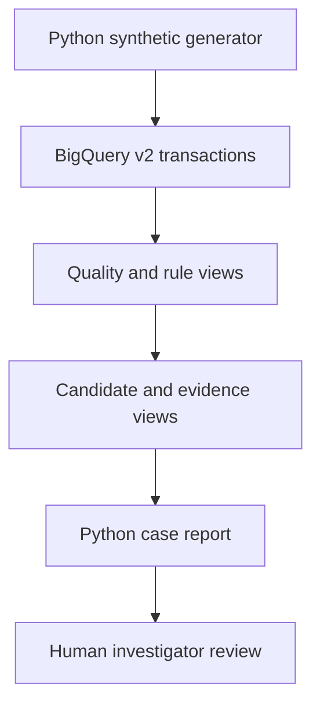

# Compliance Investigation Agent — Team Handoff

**Status as of October 4, 2026**  
**Owner:** Elisha Damor  
**Scope:** Synthetic pharmacy claims portfolio project  
**Platform:** Python, Google BigQuery, Git/GitHub  
**BigQuery project:** `compliance-agent-509701`  
**Dataset / location:** `compliance_analytics` / `US`

## 1. Executive summary

We built a reproducible synthetic claims pipeline that generates 50,000 transactions, loads them into BigQuery, applies two review rules, collects evidence for flagged claims, and produces a JSON case report with a decision for each applicable policy. The current rules are:

- **R001_HIGH_CLAIM_AMOUNT:** high paid claim relative to a pharmacy's routine claim amount.
- **R002_REPEAT_FILL:** a closely repeated paid claim with matching patient, pharmacy, drug, quantity, and amount.

The combined SQL candidate view contains **550 unique flagged transactions**. Against synthetic ground truth, the combined flags find all **400 planted review-positive transactions**, with **150 additional flagged transactions**. The combined flag precision is **72.7%** and recall is **100%** on this generated dataset. These are *candidate detection* metrics, not validated performance of the later Python policy decisions or evidence of fraud.

An `INVESTIGATOR_REVIEW` decision is a recommendation for a human to examine the evidence. No automated adverse action or escalation is authorized by a flag alone.

## 2. System flow and ownership



| Stage | Purpose | Implemented artifact |
|---|---|---|
| Generate | Create reproducible synthetic claims and separate ground-truth labels | `scripts/generate_data.py`; `data/generated/ground_truth_v2.csv` |
| Load | Make v2 claims queryable in BigQuery | `scripts/load_transactions_v2.py`; `pharmacy_transactions_v2` |
| Validate quality | Mark missing/invalid evidence before rule use | `v2_claim_quality` |
| Flag R001 | Identify high paid claims | `v2_high_amount_flags` |
| Flag R002 | Identify repeat-fill signals and prior claim references | `v2_repeat_fill_flags` |
| Combine | Produce one candidate row per transaction with `rule_ids` | `v2_case_candidates` |
| Enrich | Add claim and pharmacy baseline evidence and prior claim reference | `v2_case_evidence` |
| Retrieve | Fetch an individual case or complete repeat pair | `scripts/get_case.py`; `scripts/get_repeat_pair.py` |
| Decide | Evaluate R001 and R002 against versioned JSON policies | `scripts/policy_engine.py`; `scripts/evaluate_r002.py` |
| Report | Return evidence plus one decision per applicable policy | `scripts/build_case_report.py` |
| Measure | Compare candidate IDs against synthetic ground truth | `scripts/evaluate_rules.py` |

The Python project runs locally from `C:\Users\Elish\compliance-investigation-agent` in a virtual environment. BigQuery stores the queryable transaction and view layer; the local repository stores code and policies. The generated rows and ground truth are local artifacts excluded from Git.

## 3. Data and SQL layer

### Dataset versions

The initial prototype used a 500-row synthetic table, `pharmacy_transactions`, and initial quality/evidence views. The current evaluation and reporting path uses the **v2 50,000-row dataset**, `pharmacy_transactions_v2`. Legacy `v_case_evidence` and `scripts/apply_policy.py` refer to the initial prototype; the new unified case report queries `v2_case_evidence`.

### v2 checks and observed volumes

| Measure | Observed result | Interpretation |
|---|---:|---|
| Generated v2 transactions / ground-truth IDs | 50,000 | One label per unique transaction ID; uniqueness is checked by the evaluation script. |
| Quality `PASS` | 49,900 | Claims available to the review rules. |
| Missing prescriber quality exception | 100 | Quality exceptions are separated from normal rule assessment. |
| R001 candidates | 400 | High-amount flags, including 250 planted review positives and 150 planted benign high claims. |
| R002 candidates | 150 | Repeat-fill flags in this dataset. |
| Combined unique candidates | 550 | `v2_case_candidates` returns one case per flagged transaction, with an array of rule IDs. |

The SQL views separate *data quality*, *detection*, and *case evidence*. `v2_case_evidence` includes current claim identifiers and attributes, a pharmacy routine-claim count and average, an amount-to-average ratio, and prior transaction references where relevant. Python retrieves the full prior record through a left join to `v2_claim_quality`; using a left join retains a candidate even when the referenced prior record cannot be retrieved.

**Grain and keys:** The transaction table and local ground truth are intended to have one row per `transaction_id`. The case view has one row per `case_id`, corresponding to the flagged transaction. A case may carry multiple `rule_ids`; therefore, policy decisions are an array rather than one global decision. Retrieval uses a parameterized `@case_id` and rejects zero or multiple case rows.

## 4. Policy logic

### R001 — high claim amount

Policy source: `policies/R001_HIGH_CLAIM_AMOUNT.json`, version `1.0`.

1. The SQL signal identifies a quality-passing, paid claim of at least **$500**.
2. Python checks required evidence: transaction ID, pharmacy ID, claim amount and status, routine-claim count, routine average, and amount-to-average ratio.
3. If required evidence is missing or there are fewer than **10** routine claims, the decision is `NEEDS_MORE_EVIDENCE`.
4. If the claim amount is at least **3 times** the pharmacy routine average, the decision is `INVESTIGATOR_REVIEW`.
5. Otherwise the decision is `MONITOR`.

The combined report checks quality status against the policy and adapts v2's `rule_ids` array to the legacy R001 evaluator's single `rule_id` input. In this particular v2 dataset, no R001 candidate with a ratio below 3 was found, so a real v2 `MONITOR` example has not been demonstrated. R001 still flags 150 synthetic benign high claims; the ratio rule does not distinguish these labels.

### R002 — repeat fill

Policy source: `policies/R002_REPEAT_FILL.json`, version `1.0`.

The Python evaluator retrieves both the flagged current claim and the referenced prior claim. It requires matching **patient ID, pharmacy ID, drug ID, quantity, and claim amount**, paid status and passing quality on both records, and a nonnegative gap of at most **7 days**. Amounts are compared as decimal numbers; dates are compared as dates, and the gap is recalculated from the records rather than trusted from a display field.

| Evidence state | Policy decision |
|---|---|
| Prior required fields are absent | `NEEDS_MORE_EVIDENCE` |
| Prior record conflicts with the signal, statuses/quality do not pass, or interval is outside the window | `MONITOR` |
| Complete matching pair within seven days | `INVESTIGATOR_REVIEW` |

Both JSON policies declare `human_approval_required_for_escalation: true`. A matching pair is a review signal, not proof of an improper fill; legitimate processing or refill activity may explain it.

## 5. Example cases verified end to end

| Case | Evidence | Policy result |
|---|---|---|
| `TXN2-000463` | Paid claim `$692.57`; 442 routine pharmacy claims averaging `$134.20`; amount ratio `5.16`; quality `PASS` | R001 `INVESTIGATOR_REVIEW`; no required evidence missing. |
| `TXN2-000912` | Current paid claim June 22, 2026; prior `TXN2-017575` on June 21; same patient, pharmacy, drug, quantity 35, and amount `$197.99`; both quality `PASS` | R002 `INVESTIGATOR_REVIEW`; one day apart. |

For R002, we also changed a **copy held only in PowerShell memory** to set the prior quantity to 36; the decision became `MONITOR`. Setting the prior record ID to null produced `NEEDS_MORE_EVIDENCE`. Neither exercise changed BigQuery records.

## 6. Evaluation method and results

`scripts/evaluate_rules.py --source r001|combined` loads the 50,000-row local `ground_truth_v2.csv`, queries the chosen BigQuery flag/candidate view for transaction IDs, checks for duplicate or unknown IDs, and calculates a confusion matrix. The ground-truth positive label is `expected_review == "1"`.

| Candidate source | TP | FP | FN | TN | Precision | Recall |
|---|---:|---:|---:|---:|---:|---:|
| R001 flags | 250 | 150 | 150 | 49,450 | 62.5% | 62.5% |
| Combined R001 + R002 flags | 400 | 150 | 0 | 49,450 | 72.7% | 100.0% |

Definitions: **TP** is a flagged review-positive transaction; **FP** is flagged but labeled benign; **FN** is review-positive but not flagged; **TN** is neither flagged nor labeled review-positive. Precision is `TP / (TP + FP)`; recall is `TP / (TP + FN)`. The 150 R002 candidates recover the 150 positives missed by R001 in this synthetic dataset. These metrics evaluate the **SQL candidate set**, not investigator outcomes or the accuracy of the policy recommendations.

## 7. How to run the current workflow

Use PowerShell from the project root with the virtual environment activated and Google Application Default Credentials configured for the BigQuery project. The queries explicitly run in `US` and use parameterized case IDs.

```powershell
# See candidate evaluation against local synthetic ground truth.
python .\scripts\evaluate_rules.py --source r001
python .\scripts\evaluate_rules.py --source combined

# Inspect raw v2 case evidence.
python .\scripts\get_case.py --case-id TXN2-000463

# Retrieve a current repeat claim and its prior record.
python .\scripts\get_repeat_pair.py --case-id TXN2-000912

# Evaluate R002 as a standalone JSON pipeline.
python .\scripts\get_repeat_pair.py --case-id TXN2-000912 | python .\scripts\evaluate_r002.py

# Produce one evidence-and-decision report, using the same command for either rule.
python .\scripts\build_case_report.py --case-id TXN2-000463
python .\scripts\build_case_report.py --case-id TXN2-000912
```

`--case-id` means the **flagged current transaction ID**. The prior transaction ID is evidence attached to that case; passing the prior ID will return zero cases unless that transaction independently has a case row.

For R001, `build_case_report.py` calls `policy_engine.evaluate_case`. For R002, it calls the importable `evaluate_repeat_pair` function. The report contains `case_id`, a complete `evidence` object, and `policy_decisions` with the policy ID/version, decision, and human approval requirement. The R002 result includes a reason; the R001 result currently includes a list of missing evidence fields.

## 8. Version control and verification status

- The repository is maintained in Git/GitHub. Generated transaction data and local ground truth are not committed.
- Commit **`ca9bea6`** was confirmed for `policies/R002_REPEAT_FILL.json`, `scripts/get_repeat_pair.py`, and `scripts/evaluate_r002.py`.
- The R002 refactor and `scripts/build_case_report.py` were subsequently exercised successfully for the two example cases. A command to commit and push these later changes was given, but its result has **not** been shown in this conversation; the team should verify `git status` and the remote branch before treating them as published.
- Validation observed: JSON policy syntax check; BigQuery retrieval for R001 and R002; all three R002 decision branches via one real pair and two in-memory variations; unified report output for one R001 and one R002 case; synthetic candidate evaluation above.
- No automated regression suite, batch policy-decision evaluation, dashboard, production deployment, or investigator approval workflow has been demonstrated yet.

## 9. Known limits and next work

1. **Synthetic only:** Counts and metrics describe generated claims with planted labels. Do not present them as real-world claims performance, fraud prevalence, or compliance determinations.
2. **Human decision remains outside the tool:** The report recommends review; it does not record reviewer identity, approval, disposition, or an audit trail.
3. **R001 false positives:** All 150 planted benign high claims are R001 candidates, and the current ratio criterion does not filter them out. Any adjustment should be evaluated against missed positives as well as precision.
4. **Decision testing:** Add durable tests for policy boundaries (R001 10-claim and 3× cutoffs; R002 0/7/8 days, field mismatch, missing prior, conflicting status). Manual in-memory checks currently cover three R002 outcomes.
5. **Report consistency:** R001 and R002 return slightly different decision fields. Standardize reason codes, missing evidence details, policy metadata, and schema before batch processing or a UI.
6. **Operations:** Document/review the exact v2 SQL definitions and generator/load parameters in the repository, add a repeatable environment setup, and track the source dataset/policy versions used for each report.
7. **Next project layer:** Once deterministic case reporting is stable, build an investigator-facing summary or agent layer grounded strictly in the case evidence and policy results, with citations to the fields used and no autonomous escalation.

## 10. Glossary

| Term | Meaning in this project |
|---|---|
| Flag / candidate | SQL rule signal that a transaction should be considered for review. |
| Case ID | Current flagged transaction ID used to retrieve one case. |
| Prior record | Earlier claim referenced by an R002 signal and retrieved for verification. |
| Evidence | Current claim, relevant baseline, and any prior claim fields supporting a decision. |
| Policy decision | Deterministic Python result from a versioned JSON policy and case evidence. |
| Ground truth | Synthetic label from the generator used to measure candidate detection. |
| Investigator review | Request for human assessment; not a finding of wrongdoing. |
